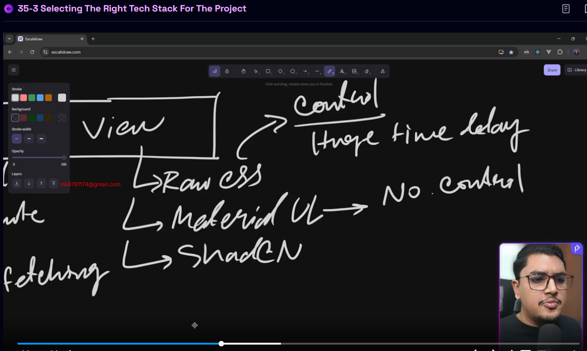
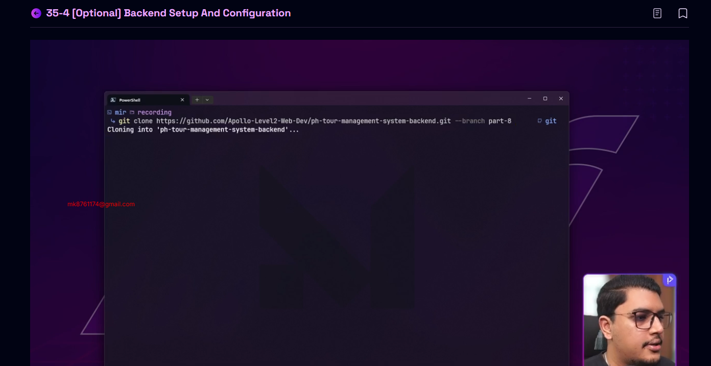

# Ph Tour Management Frontend 

## 35-1 Project Overview and Objectives
### Tour
- Role Based Authentication
- Admin Add
- User View
### Tech Use
- React+ React router+Ts
- Shadcn+origin Ui
- State Management Redux => RTK Query

## 35-2 Exploring Project Structures: Monorepo vs Polyrepo, Monolith vs Microservices

#### Project Organization

- Mono Repo it means in One Repository frontend and backend
- easier in deployment and others work like Docker

-✅ Poly Repo it Means in One Repo Frontend and Another Repo Backend
- easier for frontend dev and backend dev but some Problem in Deployment

#### Architecture
- Micro Service= Payment , User as small part all part and we give the frontend

-✅ Monolith
- single codebase
- single database
- single deployment

## 35-3 Selecting the Right Tech Stack for the Project

#### frontend Structure
- 1 Auth =✅ social login (Google) | Customs | ✅Email/Password
 Session based |✅ Token based
- 2 State => Local | (Remote ->Data Fetching)
- 3 View => Row css => Control your But need Huge Time | Material Ui => not Your Control | Sahdcn

✅ we use React 
- State Management 1 zustand 2 Redux
- Data fetching 1 = RTK Query 2 = TanStack

## 35-4 [optional] Backend Setup and Configuration
- specific Brunch Clone 
- when you set up new Project must be add env file and run project     