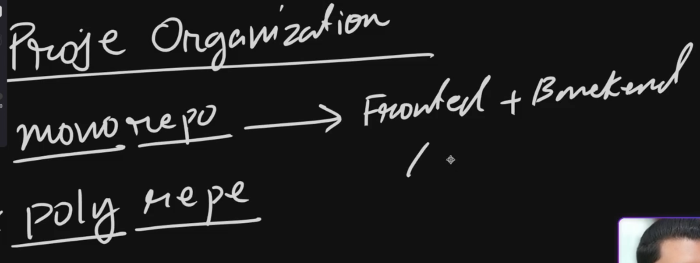
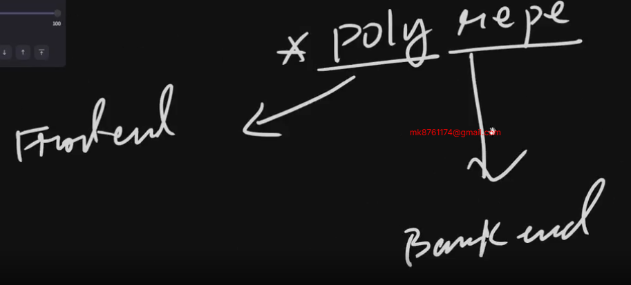
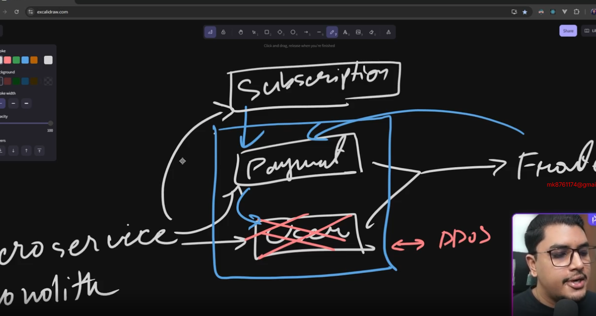

# Ph Tour Management Frontend 

## 35-1 Project Overview and Objectives
### Tour
- Role Based Authentication
- Admin Add
- User View
### Tech Use
- React+ React router+Ts
- Shadcn+origin Ui
- State Management Redux => RTK Query

## 35-2 Exploring Project Structures: Monorepo vs Polyrepo, Monolith vs Microservices

#### Project Organization

- Mono Repo it means in One Repository frontend and backend
- easier in deployment and others work like Docker

-✅ Poly Repo it Means in One Repo Frontend and Another Repo Backend
- easier for frontend dev and backend dev but some Problem in Deployment

#### Architecture
- Micro Service= Payment , User as small part all part and we give the frontend

-✅ Monolith
- single codebase
- single database
- single deployment